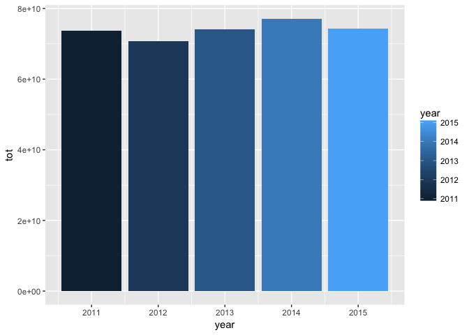

# Exploration of drug-spending - Andy Pickering


## Introduction

Modified from the automatically generated notebook for the `drug-spending` dataset found at: 
https://data.world/data4democracy/drug-spending, showcasing the use of the `data.world` R package. * Learn more at https://github.com/datadotworld/data.world-r


### Load packages

```r
library(data.world)
suppressPackageStartupMessages(library(dplyr))
suppressPackageStartupMessages(library(ggplot2))
library(tibble)
```


### List all tables in the **drug-spending** dataset:

```r
# Datasets are referenced by their URL or path
dataset_key <- "https://data.world/data4democracy/drug-spending"
# List tables available for SQL queries
tables_qry <- data.world::qry_sql("SELECT * FROM Tables")
tables_df <- data.world::query(tables_qry, dataset = dataset_key)
# See what is in it
tables_df$tableName
```

```
##  [1] "atc_codes"                   "companies_drugs_keyed"      
##  [3] "data"                        "drug_list"                  
##  [5] "drug_uses"                   "drugdata_clean"             
##  [7] "drugnames_withclasses"       "fda_ndc_product"            
##  [9] "lobbying_keyed"              "manufacturers_drugs_cleaned"
## [11] "meps_full_2014"              "methods"                    
## [13] "pharma_lobby"                "spending_2011"              
## [15] "spending_2012"               "spending_2013"              
## [17] "spending_2014"               "spending_2015"              
## [19] "spending_all_top100"         "usp_drug_classification"    
## [21] "variables"
```


## Here I will only look at the 'spending_all_top100.csv' data

```r
  spend_qry <- data.world::qry_sql(sprintf("SELECT * FROM spending_all_top100"))
  spend_df  <- data.world::query(spend_qry, dataset = dataset_key)
  glimpse(spend_df)
```

```
## Observations: 2,432
## Variables: 13
## $ drugname_brand                  <chr> "1ST TIER UNIFINE PENTIPS", "D...
## $ drugname_generic                <chr> "PEN NEEDLE, DIABETIC", "TRIAM...
## $ claim_count                     <int> 2472, 24653, 3513892, 7430, 23...
## $ total_spending                  <dbl> 57666.73, 1176003.24, 42807968...
## $ user_count                      <int> 893, 7845, 788044, 3786, 4121,...
## $ total_spending_per_user         <dbl> 64.57641, 149.90481, 54.32180,...
## $ unit_count                      <dbl> 293160, 1102423, 198967122, 25...
## $ unit_cost_wavg                  <dbl> 0.1967660, 1.0667441, 0.208900...
## $ user_count_non_lowincome        <int> 422, 5787, 356841, 1437, 2418,...
## $ out_of_pocket_avg_non_lowincome <dbl> 42.34720, 120.72891, 24.73829,...
## $ user_count_lowincome            <int> 471, 2058, 431203, 2349, 1703,...
## $ out_of_pocket_avg_lowincome     <dbl> 7.545860, 11.064125, 4.540934,...
## $ year                            <int> 2011, 2011, 2011, 2011, 2013, ...
```


### Which drugs had largest total spending? 
- Hmmm **Note** the top 4 are all insulin, and seem to be the same drug, but are enetered separately for some reason?


```r
spend_df %>% arrange(desc(total_spending)) %>% select(drugname_brand,drugname_generic,total_spending) %>% head(20)
```

```
## # A tibble: 20 x 3
##            drugname_brand               drugname_generic total_spending
##                     <chr>                          <chr>          <dbl>
##  1        ALL BRAND NAMES INSULIN GLARGINE,HUM.REC.ANLOG     4416400901
##  2 LANTUS/LANTUS SOLOSTAR INSULIN GLARGINE,HUM.REC.ANLOG     4359504167
##  3 LANTUS/LANTUS SOLOSTAR INSULIN GLARGINE,HUM.REC.ANLOG     3742568385
##  4        ALL BRAND NAMES INSULIN GLARGINE,HUM.REC.ANLOG     3742568385
##  5                 PLAVIX          CLOPIDOGREL BISULFATE     3656740021
##  6        ALL BRAND NAMES          CLOPIDOGREL BISULFATE     3656740021
##  7                CRESTOR           ROSUVASTATIN CALCIUM     2883122484
##  8        ALL BRAND NAMES           ROSUVASTATIN CALCIUM     2883122484
##  9        ALL BRAND NAMES           ATORVASTATIN CALCIUM     2797072160
## 10        ALL BRAND NAMES INSULIN GLARGINE,HUM.REC.ANLOG     2683090322
## 11 LANTUS/LANTUS SOLOSTAR INSULIN GLARGINE,HUM.REC.ANLOG     2683090322
## 12                LIPITOR           ATORVASTATIN CALCIUM     2672901532
## 13                 NEXIUM         ESOMEPRAZOLE MAGNESIUM     2660421777
## 14        ALL BRAND NAMES         ESOMEPRAZOLE MAGNESIUM     2660421777
## 15                CRESTOR           ROSUVASTATIN CALCIUM     2543786426
## 16        ALL BRAND NAMES           ROSUVASTATIN CALCIUM     2543786426
## 17        ALL BRAND NAMES         ESOMEPRAZOLE MAGNESIUM     2526306069
## 18                 NEXIUM         ESOMEPRAZOLE MAGNESIUM     2526306069
## 19        ALL BRAND NAMES         FLUTICASONE/SALMETEROL     2432083753
## 20        ALL BRAND NAMES            QUETIAPINE FUMARATE     2423843036
```

```r
##spend_df %>% arrange(desc(total_spending)) %>% select(drugname_generic,total_spending) %>% top_n(5) %>%head ```
```

### The generic drugname 'INSULIN GLARGINE,HUM.REC.ANLOG' appears in 13 separate rows, and is associated w/ 3 different 'drugname_brand's. Should these be combined? Perhaps grouped by the brand name?


```r
spend_df %>% filter(drugname_generic=='INSULIN GLARGINE,HUM.REC.ANLOG') %>% head(20)
```

```
## # A tibble: 11 x 13
##            drugname_brand               drugname_generic claim_count
##                     <chr>                          <chr>       <int>
##  1 LANTUS/LANTUS SOLOSTAR INSULIN GLARGINE,HUM.REC.ANLOG     8727003
##  2 LANTUS/LANTUS SOLOSTAR INSULIN GLARGINE,HUM.REC.ANLOG     8855330
##  3        TOUJEO SOLOSTAR INSULIN GLARGINE,HUM.REC.ANLOG       99137
##  4        ALL BRAND NAMES INSULIN GLARGINE,HUM.REC.ANLOG     7137741
##  5        ALL BRAND NAMES INSULIN GLARGINE,HUM.REC.ANLOG     7773632
##  6        ALL BRAND NAMES INSULIN GLARGINE,HUM.REC.ANLOG     8465704
##  7        ALL BRAND NAMES INSULIN GLARGINE,HUM.REC.ANLOG     8727003
##  8        ALL BRAND NAMES INSULIN GLARGINE,HUM.REC.ANLOG     8954467
##  9 LANTUS/LANTUS SOLOSTAR INSULIN GLARGINE,HUM.REC.ANLOG     7773632
## 10 LANTUS/LANTUS SOLOSTAR INSULIN GLARGINE,HUM.REC.ANLOG     7137741
## 11 LANTUS/LANTUS SOLOSTAR INSULIN GLARGINE,HUM.REC.ANLOG     8465704
## # ... with 10 more variables: total_spending <dbl>, user_count <int>,
## #   total_spending_per_user <dbl>, unit_count <dbl>, unit_cost_wavg <dbl>,
## #   user_count_non_lowincome <int>, out_of_pocket_avg_non_lowincome <dbl>,
## #   user_count_lowincome <int>, out_of_pocket_avg_lowincome <dbl>,
## #   year <int>
```


### Turns out there are a lot of repeated drug names in the dataset:


```r
print( paste('Out of ',nrow(spend_df),' rows, there are ',length(unique(spend_df$drugname_generic)),' unique generic names '))
```

```
## [1] "Out of  2432  rows, there are  100  unique generic names "
```


```r
print( paste('Out of ',nrow(spend_df),' rows, there are ',length(unique(spend_df$drugname_brand)),' unique brand names '))
```

```
## [1] "Out of  2432  rows, there are  436  unique brand names "
```


### Try plotting total spending by year

```r
spend_df %>%
        group_by(year) %>%
        summarise(tot=sum(total_spending)) %>%
        ggplot(aes(year,tot)) +
        geom_bar(stat='identity',aes(fill=year))
```

<!-- -->


