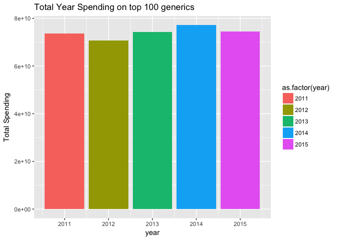

# Exploration of drug-spending - Andy Pickering


# Introduction
- This notebook contains some explroatory data analysis of the *spending_all_top100.csv* data
- Part of the d4d *drug_spending* project: <https://github.com/Data4Democracy/drug-spending>
- Notebook modified from the automatically generated notebook for the `drug-spending` dataset found at: https://data.world/data4democracy/drug-spending, showcasing the use of the `data.world` R package. * Learn more at https://github.com/datadotworld/data.world-r

# TO-DO
- Fit linear regression vs year to each generic, see which ones are rising the most.
- Look at price per user, not just total price.
- Look at number of users, number of low-income users, etc.


## Load packages

```r
library(data.world)
suppressPackageStartupMessages(library(dplyr))
suppressPackageStartupMessages(library(ggplot2))
library(tibble)
```


## List all tables in the **drug-spending** dataset:

```r
# Datasets are referenced by their URL or path
dataset_key <- "https://data.world/data4democracy/drug-spending"
# List tables available for SQL queries
tables_qry <- data.world::qry_sql("SELECT * FROM Tables")
tables_df <- data.world::query(tables_qry, dataset = dataset_key)
# See what is in it
tables_df$tableName
```

```
##  [1] "atc_codes"                   "companies_drugs_keyed"      
##  [3] "data"                        "drug_list"                  
##  [5] "drug_uses"                   "drugdata_clean"             
##  [7] "drugnames_withclasses"       "fda_ndc_product"            
##  [9] "lobbying_keyed"              "manufacturers_drugs_cleaned"
## [11] "meps_full_2014"              "methods"                    
## [13] "pharma_lobby"                "spending_2011"              
## [15] "spending_2012"               "spending_2013"              
## [17] "spending_2014"               "spending_2015"              
## [19] "spending_all_top100"         "usp_drug_classification"    
## [21] "variables"
```


## Here I will only look at the 'spending_all_top100.csv' data

```r
  spend_qry <- data.world::qry_sql(sprintf("SELECT * FROM spending_all_top100"))
  spend_df  <- data.world::query(spend_qry, dataset = dataset_key)
  glimpse(spend_df)
```

```
## Observations: 2,432
## Variables: 13
## $ drugname_brand                  <chr> "1ST TIER UNIFINE PENTIPS", "D...
## $ drugname_generic                <chr> "PEN NEEDLE, DIABETIC", "TRIAM...
## $ claim_count                     <int> 2472, 24653, 3513892, 7430, 23...
## $ total_spending                  <dbl> 57666.73, 1176003.24, 42807968...
## $ user_count                      <int> 893, 7845, 788044, 3786, 4121,...
## $ total_spending_per_user         <dbl> 64.57641, 149.90481, 54.32180,...
## $ unit_count                      <dbl> 293160, 1102423, 198967122, 25...
## $ unit_cost_wavg                  <dbl> 0.1967660, 1.0667441, 0.208900...
## $ user_count_non_lowincome        <int> 422, 5787, 356841, 1437, 2418,...
## $ out_of_pocket_avg_non_lowincome <dbl> 42.34720, 120.72891, 24.73829,...
## $ user_count_lowincome            <int> 471, 2058, 431203, 2349, 1703,...
## $ out_of_pocket_avg_lowincome     <dbl> 7.545860, 11.064125, 4.540934,...
## $ year                            <int> 2011, 2011, 2011, 2011, 2013, ...
```


## *Note* I originally assumed that the amounts in this file had been summed over the years. Actually from the description w/ the file on data.world (which I should have read more closely),  it is the '2011-2015 spending data combined, for the top 100 generics by total number of users in that time frame.'  There is a still a row for each year (the years have not been summed together).

We can confirm that there are 100 unique generic names in this dataset:

```r
print( paste('Out of ',nrow(spend_df),' rows, there are ',length(unique(spend_df$drugname_generic)),' unique generic names '))
```

```
## [1] "Out of  2432  rows, there are  100  unique generic names "
```


## Which generics had largest total spending (for an inidivdual year) ? 


```r
spend_df %>% 
        arrange(desc(total_spending)) %>%           
        select(drugname_brand,drugname_generic,total_spending,year) %>% 
        head(20)
```

```
## # A tibble: 20 x 4
##            drugname_brand               drugname_generic total_spending
##                     <chr>                          <chr>          <dbl>
##  1        ALL BRAND NAMES INSULIN GLARGINE,HUM.REC.ANLOG     4416400901
##  2 LANTUS/LANTUS SOLOSTAR INSULIN GLARGINE,HUM.REC.ANLOG     4359504167
##  3 LANTUS/LANTUS SOLOSTAR INSULIN GLARGINE,HUM.REC.ANLOG     3742568385
##  4        ALL BRAND NAMES INSULIN GLARGINE,HUM.REC.ANLOG     3742568385
##  5                 PLAVIX          CLOPIDOGREL BISULFATE     3656740021
##  6        ALL BRAND NAMES          CLOPIDOGREL BISULFATE     3656740021
##  7                CRESTOR           ROSUVASTATIN CALCIUM     2883122484
##  8        ALL BRAND NAMES           ROSUVASTATIN CALCIUM     2883122484
##  9        ALL BRAND NAMES           ATORVASTATIN CALCIUM     2797072160
## 10        ALL BRAND NAMES INSULIN GLARGINE,HUM.REC.ANLOG     2683090322
## 11 LANTUS/LANTUS SOLOSTAR INSULIN GLARGINE,HUM.REC.ANLOG     2683090322
## 12                LIPITOR           ATORVASTATIN CALCIUM     2672901532
## 13                 NEXIUM         ESOMEPRAZOLE MAGNESIUM     2660421777
## 14        ALL BRAND NAMES         ESOMEPRAZOLE MAGNESIUM     2660421777
## 15                CRESTOR           ROSUVASTATIN CALCIUM     2543786426
## 16        ALL BRAND NAMES           ROSUVASTATIN CALCIUM     2543786426
## 17        ALL BRAND NAMES         ESOMEPRAZOLE MAGNESIUM     2526306069
## 18                 NEXIUM         ESOMEPRAZOLE MAGNESIUM     2526306069
## 19        ALL BRAND NAMES         FLUTICASONE/SALMETEROL     2432083753
## 20        ALL BRAND NAMES            QUETIAPINE FUMARATE     2423843036
## # ... with 1 more variables: year <int>
```

## Which generics had largest total spending over all 5 years?

```r
spend_df %>% 
        group_by(drugname_generic) %>%
        summarise(tot = sum(total_spending)) %>%
        arrange( desc(tot)) %>%
        head(20)
```

```
## # A tibble: 20 x 2
##                  drugname_generic         tot
##                             <chr>       <dbl>
##  1 INSULIN GLARGINE,HUM.REC.ANLOG 28508470761
##  2         ESOMEPRAZOLE MAGNESIUM 23123163140
##  3         FLUTICASONE/SALMETEROL 21886759828
##  4           ROSUVASTATIN CALCIUM 21698484912
##  5             TIOTROPIUM BROMIDE 18620702056
##  6                  MEMANTINE HCL 15311498678
##  7           ATORVASTATIN CALCIUM 14826135404
##  8          CLOPIDOGREL BISULFATE 14314936581
##  9            QUETIAPINE FUMARATE 13924286981
## 10                 DULOXETINE HCL 13672910525
## 11                  OXYCODONE HCL 11547474499
## 12                      VALSARTAN  9615610746
## 13                      CELECOXIB  7733514140
## 14           METOPROLOL SUCCINATE  7086834869
## 15           LEVOTHYROXINE SODIUM  6754853939
## 16              ALBUTEROL SULFATE  5948476058
## 17      HYDROCODONE/ACETAMINOPHEN  5901484527
## 18                     OMEPRAZOLE  5825787016
## 19             POTASSIUM CHLORIDE  5537928041
## 20                     GABAPENTIN  5111233323
```


## Try plotting total spending by year

```r
spend_df %>%
        group_by(year) %>%
        summarise(tot=sum(total_spending)) %>%
        ggplot(aes(year,tot)) +
        geom_bar(stat='identity',aes(fill=as.factor(year))) +
        ylab("Total Spending") +
        ggtitle("Total Year Spending on top 100 generics")
```

<!-- -->


## Which generic had largest difference in spending from 2011-2015 ?
- First group by generic and get yearly totals

```r
df_yearly <- spend_df %>%
        group_by(drugname_generic,year) %>%
        summarize(tot = sum(total_spending)) %>%
        arrange(drugname_generic,year) 
head(df_yearly)
```

```
## # A tibble: 6 x 3
## # Groups:   drugname_generic [2]
##             drugname_generic  year       tot
##                        <chr> <int>     <dbl>
## 1 ACETAMINOPHEN WITH CODEINE  2011  75998118
## 2 ACETAMINOPHEN WITH CODEINE  2012  71117411
## 3 ACETAMINOPHEN WITH CODEINE  2013  66941860
## 4 ACETAMINOPHEN WITH CODEINE  2014  64234657
## 5 ACETAMINOPHEN WITH CODEINE  2015  88516968
## 6          ALBUTEROL SULFATE  2011 799241691
```

- Then compute largest diff between largest and smallest price.

```r
df_yearly %>% 
        group_by(drugname_generic) %>%
        summarise(diff = max(tot)-min(tot)) %>%
        arrange( desc(diff))
```

```
## # A tibble: 100 x 2
##                  drugname_generic       diff
##                             <chr>      <dbl>
##  1          CLOPIDOGREL BISULFATE 6825638669
##  2 INSULIN GLARGINE,HUM.REC.ANLOG 5898753265
##  3           ATORVASTATIN CALCIUM 4083817019
##  4            QUETIAPINE FUMARATE 3259919242
##  5           ROSUVASTATIN CALCIUM 2933614943
##  6                 DULOXETINE HCL 2437592083
##  7             TIOTROPIUM BROMIDE 2026517571
##  8                  DONEPEZIL HCL 1698639752
##  9                  MEMANTINE HCL 1582852432
## 10                      VALSARTAN 1479791635
## # ... with 90 more rows
```


